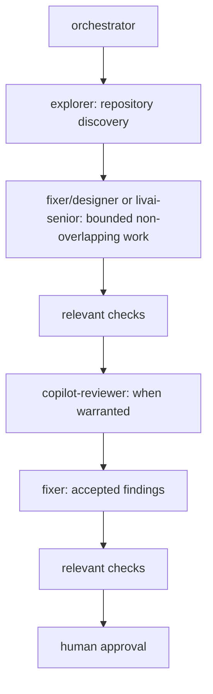

# Quickstart: Slim Hybrid Workflow

## Default flow



## Hybrid Workflow Preferences

- `orchestrator` coordinates the flow and decisions that require human approval.
- Use `explorer` for repository discovery and `librarian` for external research.
- Delegate bounded, non-overlapping implementation work to `fixer`, `designer`, or `livai-senior`; `livai-senior` has a configured provider fallback.
- Use `copilot-reviewer` when independent review is warranted, and resolve accepted findings with `fixer`.
- Reserve `oracle` and `council` for high-judgment or high-risk decisions.

Reviewers receive the task, accepted plan, implementation summary, full diff, and test output. Agent agreement is not a substitute for checks or human approval.

## Using the workflow

Use `orchestrator` as the primary agent:

```text
Use orchestrator.

Task:
<task>
```

Do not assign concurrent workers overlapping file ownership. Send completed work to `copilot-reviewer` for independent review when warranted, and resolve only accepted findings.

### Handoff format

Keep handoffs concise and include the changed files, checks, risks, and review focus. Use `None.` for an empty section.

```text
Changed:
- src/example.ts: preserve empty input.

Checks:
- npm test: pass.

Risks:
- None.

Review focus:
- empty-input behavior.
```

## Configuration

The core OpenCode configuration is user-owned. This repository's separate core host template is `global/opencode/opencode.jsonc`; the Slim plugin configuration is `global/opencode/oh-my-opencode-slim.jsonc`.

`make install` copies the two Slim customizations to package-managed canonical storage and links only these destinations into `${OPENCODE_CONFIG_DIR:-~/.config/opencode}`:

- `oh-my-opencode-slim.jsonc`
- `oh-my-opencode-slim/hybrid/orchestrator_append.md`

It intentionally does **not** write, link, or overwrite user-owned core `opencode.json` or `opencode.jsonc`. Restart OpenCode after installation or configuration changes.

The hybrid preset's orchestrator additions are kept in `global/opencode/oh-my-opencode-slim/hybrid/orchestrator_append.md`. Use `orchestrator` as the OpenCode entry point.

See the [Slim setup and configuration](README.md#slim-setup-and-configuration) section for installation and the configuration differences from stock Slim.

## Lifecycle

```bash
make test
make structure-test
make uninstall
```
