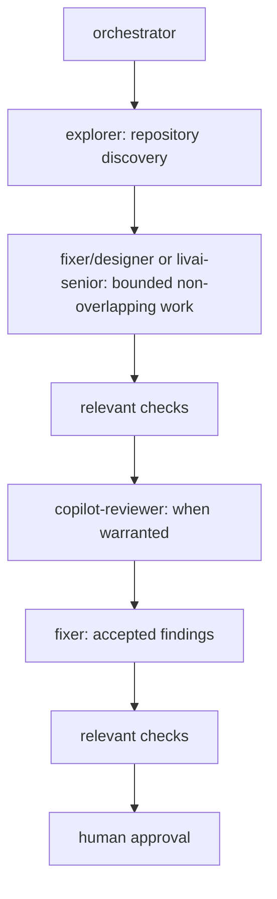

# Quickstart: Slim Hybrid Workflow

## Install

Install oh-my-opencode-slim with its official non-interactive command:

```bash
bunx oh-my-opencode-slim@latest install --no-tui --skills=yes --background-subagents=yes
# Fallback when Bun is unavailable:
npx oh-my-opencode-slim@latest install --no-tui --skills=yes --background-subagents=yes
```

Then install this repository's Slim customizations:

```bash
make install
```

`make install` links only the Slim configuration and hybrid append into `${OPENCODE_CONFIG_DIR:-~/.config/opencode}`. It intentionally never overwrites the user-owned core `opencode.json` or `opencode.jsonc`. Restart OpenCode after either installation or configuration changes.

## Start

```text
Use orchestrator.

Task:
<paste task>
```

## Default flow



## Hybrid Workflow Preferences

- `orchestrator` coordinates the flow and decisions that require human approval.
- Use `explorer` for repository discovery and `librarian` for external research.
- Delegate bounded, non-overlapping implementation work to `fixer`, `designer`, or `livai-senior`; `livai-senior` has a configured provider fallback.
- Use `copilot-reviewer` when independent review is warranted, and resolve accepted findings with `fixer`.
- Reserve `oracle` and `council` for high-judgment or high-risk decisions.

Reviewers receive the task, accepted plan, implementation summary, full diff, and test output. Agent agreement is not a substitute for checks or human approval.

## Configuration

The core OpenCode configuration is user-owned. This repository keeps its separate core host template in `global/opencode/opencode.jsonc`, its Slim plugin configuration in `global/opencode/oh-my-opencode-slim.jsonc`, and preset-specific orchestrator instructions in `global/opencode/oh-my-opencode-slim/hybrid/orchestrator_append.md`.

See [OpenCode configuration](docs/opencode.md) and [oh-my-opencode-slim integration](docs/oh-my-opencode-slim.md).

## Lifecycle

```bash
make test
make structure-test
make uninstall
```
