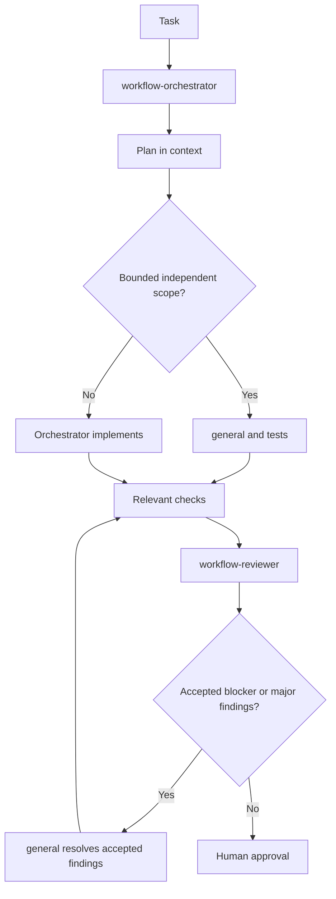

# Quickstart: Orchestrated Multi-Agent Workflow

## Install

```bash
make install
# Equivalent explicit OpenCode alias:
make install-opencode
# Equivalent uninstall alias:
make uninstall-opencode
# Optional, for NERSC environments:
make install-nersc-rules
```

The supported lifecycle scripts are `global/install-global-agent-workflow.sh` and
`global/uninstall-global-agent-workflow.sh`; the Make targets are their preferred interface.
The optional NERSC profile lives under `profiles/nersc/` and preserves existing instructions.

## Start

Use one primary agent as orchestrator:

```text
Use workflow-orchestrator.

Task:
<paste task>
```

It must inspect repository instructions, classify risk, and delegate bounded work.

Every specialist returns fixed headings with no preamble. Keep bullets bounded; use `None.` for empty sections.

## Default Flow



## Delegation Rules

- Orchestrator: plans in context and retains ambiguous, architectural, shared-core, or cross-cutting work.
- Implementer: owns an explicit file/scope boundary, relevant tests, and minimal changes.
- TDD: optional for explicit test-first workflows; it is not part of the default OpenCode agent set.
- Concurrent implementers: never assign overlapping file ownership.
- Reviewer: independent; receives task, accepted plan, implementation summary, full diff, and test output.
- Resolver: fixes accepted blocker/major findings only.
- Orchestrator: runs relevant checks, reports blockers, and asks for human approval for unclear or irreversible decisions.

## OpenCode

`make install` or `make install-opencode` installs `workflow-orchestrator` and `workflow-reviewer` under `~/.config/opencode/agents/`; built-in `general` handles bounded implementation. Run `make update-opencode-agents` to replace only the user configuration's `agent` section from `global/opencode/opencode.jsonc`. Set `default_agent: "workflow-orchestrator"` and `subagent_depth: 1` separately if needed. Select the orchestrator in OpenCode. It uses built-in `explore` for discovery and handles complex work directly. Restart OpenCode after installation or configuration changes.

For small tasks, use the orchestrator alone. For medium tasks, add exploration for unfamiliar code and an implementer only for bounded work. For large tasks, parallelize only independent discovery or non-overlapping implementation scopes, then review the assembled final diff.

### oh-my-opencode-slim

Install the plugin with:

```bash
bunx oh-my-opencode-slim@latest install
```

See the [oh-my-opencode-slim integration](docs/oh-my-opencode-slim.md) for installation, template customizations, and configuration boundaries.

## Further reading

- [Usage](docs/usage.md)
- [NERSC filesystem rules](docs/nersc.md)
- [OpenCode configuration](docs/opencode.md)
- [oh-my-opencode-slim integration](docs/oh-my-opencode-slim.md)

## Lifecycle

```bash
make test
make structure-test
make uninstall
```

`make test` runs lifecycle and structure checks. `make uninstall` removes package-managed workflow files and preserves unrelated tool configuration.
