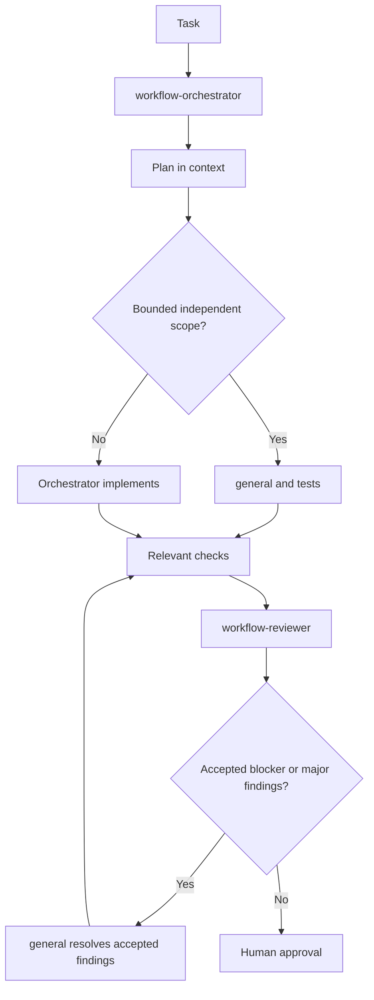

# Quickstart: Orchestrated Multi-Agent Workflow

## Install

```bash
make install
# Or install only the tool you use:
make install-opencode
make install-codex
make install-claude
make install-copilot
# Remove only one tool's workflow artifacts:
make uninstall-opencode
make uninstall-codex
make uninstall-claude
make uninstall-copilot
```

## Start

Use one primary agent as orchestrator:

```text
Use workflow-orchestrator.

Task:
<paste task>
```

It must inspect repository instructions, classify risk, and delegate bounded work.

Every specialist returns fixed headings with no preamble. Keep bullets bounded; use `None.` for empty sections.

## Default Flow



## Delegation Rules

- Orchestrator: plans in context and retains ambiguous, architectural, shared-core, or cross-cutting work.
- Implementer: owns an explicit file/scope boundary, relevant tests, and minimal changes.
- TDD: optional for explicit test-first workflows; it is not part of the default OpenCode agent set.
- Concurrent implementers: never assign overlapping file ownership.
- Reviewer: independent; receives task, accepted plan, implementation summary, full diff, and test output.
- Resolver: fixes accepted blocker/major findings only.
- Orchestrator: runs relevant checks, reports blockers, and asks for human approval for unclear or irreversible decisions.

## OpenCode

`make install` or `make install-opencode` installs `workflow-orchestrator` and `workflow-reviewer` under `~/.config/opencode/agents/`; built-in `general` handles bounded implementation. Run `make update-opencode-agents` to replace only the user configuration's `agent` section from `global/opencode/opencode.json`. Set `default_agent: "workflow-orchestrator"` and `subagent_depth: 1` separately if needed. Select the orchestrator in OpenCode. It uses built-in `explore` for discovery and handles complex work directly. Restart OpenCode after installation or configuration changes.

For small tasks, use the orchestrator alone. For medium tasks, add exploration for unfamiliar code and an implementer only for bounded work. For large tasks, parallelize only independent discovery or non-overlapping implementation scopes, then review the assembled final diff.

## VS Code Agent Setup

`make install` or `make install-copilot` installs `workflow-orchestrator`, `explore`, `general`, and `workflow-reviewer` under `~/.copilot/agents/`. Reload VS Code, select `workflow-orchestrator` in Chat, and submit the task. `/workflow-orchestrate` starts the same custom agent; other `/workflow-*` prompts remain available for focused specialist work.

The custom agents mirror OpenCode's Sol/Luna/Terra/Claude model routing and tool boundaries. Keep nested subagents disabled (the VS Code default) for one-level delegation. Model availability depends on your Copilot plan and organization policy.

## Lifecycle

```bash
make test
make structure-test
make uninstall
```

`make test` runs lifecycle and structure checks. `make uninstall` removes package-managed workflow files and preserves unrelated tool configuration.
