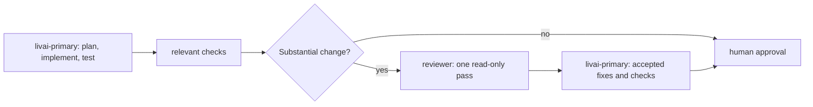

# Simple OpenCode Three-Agent Workflow

This repository provides a small, native OpenCode configuration for software development.

## Workflow



`livai-explorer` is optional. `livai-primary` invokes it only for a precise, read-only codebase investigation that will materially reduce uncertainty. It never edits files.

## Agents

| Agent      | Model                            | Role                                                                                      | Permissions                                                                              |
| ---------- | -------------------------------- | ----------------------------------------------------------------------------------------- | ---------------------------------------------------------------------------------------- |
| `livai-primary`  | `livai/gpt-5.6-terra`, medium   | Default primary: plans, implements, tests, and fixes. Use high reasoning only for difficult or risky work. | Normal development access; may call only LivAI Explorer or Reviewer. |
| `livai-explorer` | `livai/gpt-5.6-luna`, low       | Targeted repository investigation for LivAI Primary.                                      | Read/search only; no shell, edits, web access, or delegation.       |
| `reviewer` | `github-copilot/claude-sonnet-5` | One independent review after substantial changes.                                         | Read-only; may inspect `git status`, `git diff`, and `git show`; no edits or delegation. |

The existing `primary` and `explorer` agents remain available as the OpenAI-backed workflow. Select `primary` explicitly when you want that path. GitHub Copilot remains the reviewer for both workflows. If it is unavailable, configure the `reviewer` model as `livai/gpt-5.6-sol` with high reasoning. The reviewer is skipped for trivial or mechanical edits.

Explorer and Reviewer each have one focused skill, installed globally by `make install`:

- `explore`: concise read-only codebase investigation.
- `review`: one read-only review pass.

Primary uses its always-on prompt and has no skill access. Each remaining skill is visible only to its matching agent. Shared engineering rules live in [AGENTS.md](AGENTS.md).

## Providers

The OpenCode template enables these providers:

- OpenAI, for the alternate `primary` and `explorer` workflow.
- GitHub Copilot, for the preferred Claude Sonnet 5 reviewer.
- LivAI, for the default `livai-primary` and `livai-explorer` workflow. Its custom endpoint includes `livai/gpt-5.6-terra`, `livai/gpt-5.6-luna`, `livai/gpt-5.6-sol`, and `livai/claude-sonnet-4.5`. LivAI is deliberately a first-class workflow, not an automatic fallback.

Authenticate the providers you intend to use, then refresh the model list:

```bash
opencode auth login
make refresh-models
```

Confirm the exact IDs exposed to your account before changing model assignments. For LivAI, set the API key in your user-owned configuration; never commit it.

## Setup

1. Install OpenCode using its [official instructions](https://opencode.ai/).
2. Initialize the user-owned configuration only if it does not already exist:

   ```bash
   make install
   ```

   This copies `global/opencode/opencode.jsonc` and the two skills to `${OPENCODE_CONFIG_DIR:-~/.config/opencode}`. It never replaces an existing configuration or same-named skill.

3. Authenticate the providers above and start OpenCode.

Existing user-owned configuration remains yours. Merge the three-agent section deliberately rather than overwriting it, then install any missing skills without changing your config:

```bash
make install-skills
```

### Refreshing template sections

`make update-agents` and `make update-opencode-sections` run `make refresh-models` before updating configuration. If the model refresh fails, the configuration update stops.

When model releases require configuration updates, refresh only the relevant user-owned sections from the repository template:

```bash
make update-livai-models
make update-agents
make update-permissions
make update-agents-md
```

`make update-opencode-sections` refreshes all three configuration sections together. `make update-agents-md` creates or updates `${OPENCODE_CONFIG_DIR:-~/.config/opencode}/AGENTS.md` from this repository's template. The configuration commands replace only `provider.livai.models`, `agent`, or `permission`; all other settings in your `opencode.jsonc` remain unchanged.

## Optional NERSC filesystem rules

```bash
make install-nersc-rules
make uninstall-nersc-rules
```

This profile is independent of the agent configuration.

## Removing oh-my-opencode-slim

After the native configuration works, remove Slim from your active OpenCode configuration directory:

1. Back up user-owned Slim files. Run the previous repository version's `make uninstall` first if it installed managed Slim links.
2. Remove `"oh-my-opencode-slim"` from the `plugin` array in `opencode.json` or `opencode.jsonc`.
3. Restore built-in `general` and `explore` agents if Slim disabled them; remove a Slim-added `lsp` setting only when it was not pre-existing.
4. Remove the Slim entry from `tui.json` and remove `OPENCODE_EXPERIMENTAL_BACKGROUND_SUBAGENTS` from your shell startup file if Slim added it.
5. After checking ownership, remove its configuration files, managed skills, cache, and optional companion binary. Restart OpenCode and confirm Slim agents no longer appear with `opencode auth status`.

The [official Slim uninstallation guide](https://github.com/alvinunreal/oh-my-opencode-slim/blob/master/docs/installation.md#uninstallation) lists the current paths and cleanup details.

## Verification

```bash
make test
```

## Repository layout

- `global/opencode/opencode.jsonc`: user-owned native OpenCode template.
- `global/opencode/skills/`: the two focused OpenCode skills.
- `global/install-opencode-config.sh`: safe one-time config initializer.
- `profiles/nersc/`: optional filesystem instruction profile.
- `test/`: configuration and lifecycle checks.
