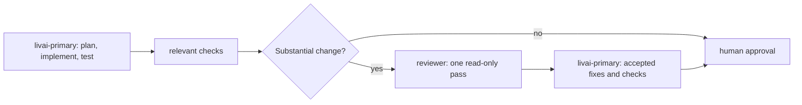

# Simple OpenCode Three-Agent Workflow

This repository provides a small, native OpenCode configuration for software development.

## Workflow



`livai-explorer` is optional. `livai-primary` invokes it only for a precise, read-only codebase investigation that will materially reduce uncertainty. It never edits files.

## Agents

| Agent            | Model                            | Role                                                                                                       | Permissions                                                                              |
| ---------------- | -------------------------------- | ---------------------------------------------------------------------------------------------------------- | ---------------------------------------------------------------------------------------- |
| `livai-primary`  | `livai/gpt-5.6-terra`, medium    | Default primary: plans, implements, tests, and fixes. Use high reasoning only for difficult or risky work. | Normal development access; may call only LivAI Explorer or Reviewer.                     |
| `livai-explorer` | `livai/gpt-5.6-luna`, low        | Targeted repository investigation for LivAI Primary.                                                       | Read/search only; no shell, edits, web access, or delegation.                            |
| `primary`        | `openai/gpt-6.1-sol`, medium     | OpenAI-backed primary: plans, implements, tests, and fixes.                                                 | Normal development access; may call only Explorer or Reviewer.                           |
| `reviewer`       | `github-copilot/claude-opus-5-5` | One independent review after substantial changes.                                                          | Read-only; may inspect `git status`, `git diff`, and `git show`; no edits or delegation. |

The existing `primary` and `explorer` agents remain available as the OpenAI-backed workflow. Select `primary` explicitly when you want that path. GitHub Copilot remains the reviewer for both workflows. If it is unavailable, configure the `reviewer` model as `livai/gpt-6.6-sol` with high reasoning. The reviewer is skipped for trivial or mechanical edits.

Explorer and Reviewer each have one focused skill, installed globally by `make install`:

- `explore`: concise read-only codebase investigation.
- `review`: one read-only review pass.

Primary uses its always-on prompt and has no skill access. Each remaining skill is visible only to its matching agent. Shared engineering rules live in [AGENTS.md](AGENTS.md).

### Primary responses

Both primary agents answer questions and review-only requests without editing. For "plan first", "no code", or unclear authorization to implement, they present the answer or plan and stop; a plan is not permission to implement. An explicit implementation request allows them to proceed through verification without another approval turn. User-specified response formats take precedence. Simple questions and trivial edits do not need a formal plan.

For non-trivial plans, use these headings in order:

1. **Problem** — the need this change addresses.
2. **Scope** — what is included.
3. **Constraints and non-goals** — what must remain unchanged or is excluded.
4. **Open questions** — omit if none; identify who must answer each question and whether it blocks implementation. State non-blocking assumptions explicitly.
5. **Acceptance criteria** — observable outcomes, not just implementation steps.
6. **Validation** — concrete checks or why none apply.

After implementation, report **Result** (what changed and the outcome), **Validation** (checks run and their results, plus relevant checks not run and why), and **Remaining issues** (omit if none). State clearly when implementation is incomplete. A plan-only response must not use this results format or imply that checks ran.

## Issue prompt commands

Use these commands with a bare issue number (for example, `42`, not `#42`):

| Command | Stage |
| --- | --- |
| `/plan 42` | Read the issue and repository instructions, inspect code, and draft a plan. No edits; stops for approval. |
| `/implement 42` | Implement the approved plan available in the conversation, update tests/docs, and run quality checks. |
| `/review-again 42` | Optional primary-agent review of the actual changes, followed by confirmed fixes and checks. |
| `/draft-pr 42` | Explicit human gate: commit intended changes, push, and open a draft PR using the repository template. |

Approve the plan before invoking `/implement`. Invoke `/draft-pr` only after reviewing the completed work and validation; the earlier stages never commit, push, or open a PR. The draft remains open for human review, with no automatic merge. These are prompt instructions, not a technical permission sandbox.

Commands use the currently selected agent. Select `livai-primary` or `primary`; the read-only `reviewer` cannot implement fixes or publish a PR. `/review-again` is a user-requested direct review/fix pass, not another delegated reviewer invocation. GitHub operations require `gh` authentication and repository access.

For an existing installation, install the commands without changing the configuration:

```bash
make install-commands
```

This copies missing files from `global/opencode/commands/` into `${OPENCODE_CONFIG_DIR:-~/.config/opencode}/commands/`. Existing same-named commands (including symlinks) are preserved. Review and merge future template changes manually. `/plan` overrides OpenCode's built-in command of the same name, if present.

## Providers

The OpenCode template enables these providers:

- OpenAI, for the alternate `primary` and `explorer` workflow.
- GitHub Copilot, for the preferred Claude Sonnet 5 reviewer.
- LivAI, for the default `livai-primary` and `livai-explorer` workflow. Its custom endpoint includes `livai/gpt-5.6-terra`, `livai/gpt-5.6-luna`, and `livai/gpt-5.6-sol`. LivAI is deliberately a first-class workflow, not an automatic fallback.

Authenticate the providers you intend to use, then refresh the model list:

```bash
opencode auth login
make refresh-models
```

Confirm the exact IDs exposed to your account before changing model assignments. For LivAI, set the API key in your user-owned configuration; never commit it.

Run `make update-opencode` to upgrade OpenCode, refresh its model catalog, and sync the configured template sections, in that order. Installations without `provider.livai` skip the LivAI model section while still updating agents and permissions. OpenCode detects the installation method automatically. A failed step stops the remaining steps.

## Setup

1. Install OpenCode using its [official instructions](https://opencode.ai/).
2. Initialize the user-owned configuration only if it does not already exist:

   ```bash
   make install
   ```

   This copies `global/opencode/opencode.jsonc`, the two skills, and the four prompt commands to `${OPENCODE_CONFIG_DIR:-~/.config/opencode}`. It never replaces an existing configuration, same-named skill, or command.

3. Authenticate the providers above and start OpenCode.

Existing user-owned configuration remains yours. Merge the three-agent section deliberately rather than overwriting it, then install any missing skills without changing your config:

```bash
make install-skills
```

To receive updates to the primary response rules in an existing installation, review and merge the two primary prompts into your user-owned configuration. Alternatively, `make update-agents` refreshes the whole `agent` section from the template (after refreshing models); it **replaces all customizations in the user-owned agent section**, not just these prompts. Review your changes before running it. `make install` copies the updated prompts only when no configuration exists yet.

### Refreshing template sections

`make update-agents` runs `make refresh-models` before updating configuration. If the model refresh fails, the configuration update stops.

When model releases require configuration updates, refresh only the relevant user-owned sections from the repository template:

```bash
make update-livai-models
make update-agents
make update-permissions
make update-agents-md
```

`make update-opencode-sections` is a compatibility alias for `make update-opencode`, including the upgrade and model refresh. `make update-agents-md` creates or updates `${OPENCODE_CONFIG_DIR:-~/.config/opencode}/AGENTS.md` from this repository's template. The configuration commands replace only `provider.livai.models`, `agent`, or `permission`; when `provider.livai` is absent, its model section is skipped. All other settings in your `opencode.jsonc` remain unchanged.

## Optional NERSC filesystem rules

```bash
make install-nersc-rules
make uninstall-nersc-rules
```

This profile is independent of the agent configuration.

## Verification

```bash
make test
```

## Repository layout

- `global/opencode/opencode.jsonc`: user-owned native OpenCode template.
- `global/opencode/skills/`: the two focused OpenCode skills.
- `global/opencode/commands/`: issue planning, implementation, optional review/fix, and human-gated draft PR prompts.
- `global/install-opencode-config.sh`: safe one-time config initializer.
- `profiles/nersc/`: optional filesystem instruction profile.
- `test/`: configuration and lifecycle checks.
